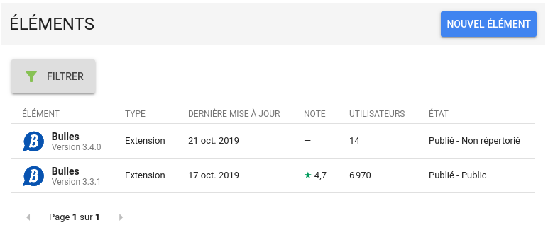
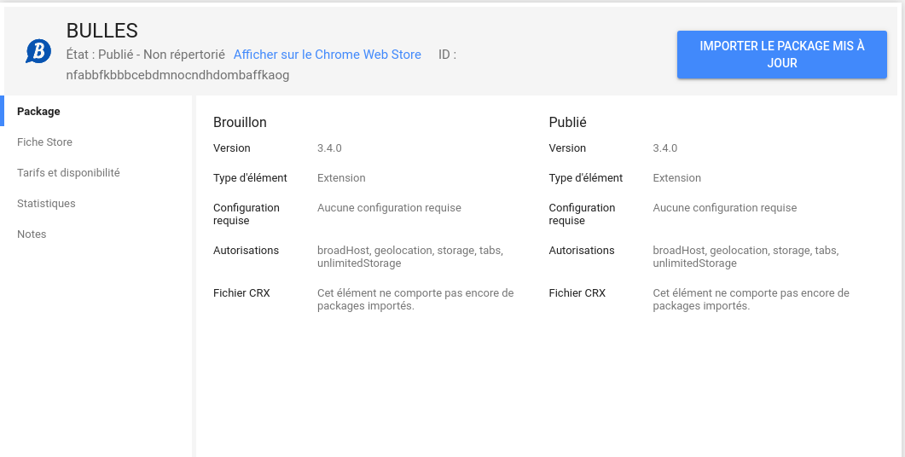
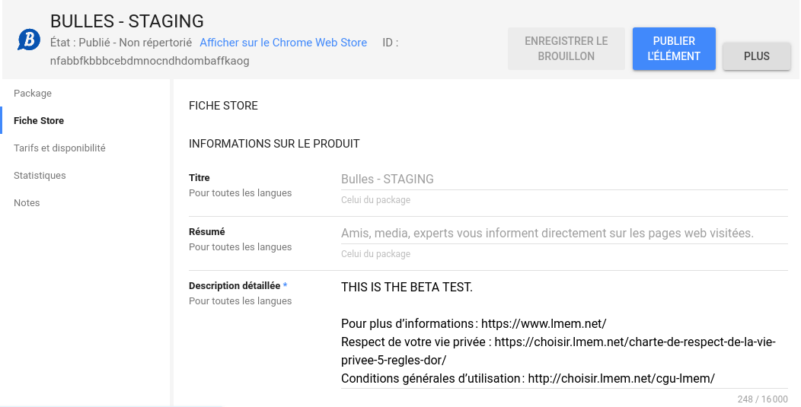

# Bulle.io - Web Extension

[](https://semaphoreci.com/bmenant_lmem/extension)

At its early stages, this software was a fork of [Crossbuilder](https://github.com/zalmoxisus/crossbuilder).
However, the software has evolved to better embrace our project needs and specificities.
As a result, the upstream codebase haven’t be merged for a while and it is unlikely to happen ever again.

## Structure

- `src/app/`: React application (will be imported in the apps bellow).
- `src/assets/`: web app fonts, images, etc.
- `src/lib/`: external _non npm_ modules.
- `manifest/`: base and environment specific web-extension manifests.
- `test/app/`: tests for Redux actions and reducers, and for React components (using [enzyme](http://airbnb.io/enzyme/)).
- `test/integration/`: runtime tests for built web-extensions.

## Installation

First install [yarn](https://yarnpkg.com/) and [nvm](https://github.com/creationix/nvm) (optional).

```bash
# git clone...
nvm use lts/carbon
yarn
```

### Sentry

To configure Sentry error reporting, you should create a `.sentryclirc` file at the root of the project directory:

```
[defaults]
project=web-extension
org=lmem

[auth]
token=4d786d88c7d9436282c35b4eb82ae2dfeaff5ee296e3404ba3654ab62c151b73
```

> **Note 1:** You'll find your token here https://sentry.io/settings/account/api/auth-tokens/

> **Note 2:** If you ever need to change the Sentry DSN go to `./webpack/config.plugins.js`.

## Environments

You'll find a bunch of env variables defined in `./webpack/config.plugins.js`.

## Development

```bash
# watch files change (do not reload the extension though)
# start Webpack Dev Server
yarn start
```

```bash
# watch files change (do not reload the extension though)
# start Webpack Dev Server with production content
yarn start:productionApi
```

- [Load unpacked extension's `./build/dev/` folder to Chrome.](https://developer.chrome.com/extensions/getstarted#unpacked)


## Deployment

### Staging

```
/!\ Warning this may be subject to change
```

Make sure develop is up to date:
```
git checkout develop
git pull develop
yarn
```

The version number need to be changed, either manually:
- Go to `package.json` and increment the version number there.

> /!\ **OR** automatically using semantic release... @todo

Commit & push:
```
git commit -m "feat(staging): bump version number"
git push origin HEAD
```

> The **feat** flag, in the commit, forces `semantic-release`, to increment the minor version number of the future production release.

Then run the release script:
```
yarn release:staging
```
This creates an archive in the `build/` directory:
```
bulles-vX.X.X-staging.zip
```

Then open the [chrome webstore](https://chrome.google.com/u/1/webstore/devconsole/g10525161170329704473?hl=fr) with the following account:
```
extensions.lmem@gmail.com
```
> Ask for the password to a super user! *OR* A super user may add your own google account to the developer group.

- Click on the staging build

> The staging build is the one is only a few users and a status *Published* but *Non listed*.

- Click on the package tab


- Finally click on the publish button


> The publication may take a moment (10 to 30mins) to be visible in the store.

### Production
1. Prepare a PR from the branch `develop` to `master` and merge it.

2. Make you sure have access to semaphore and wait until the last master built is completed with success:
https://semaphoreci.com/lmem/extension/branches/master

 - Then click on the last master build and click "Deploy manually".
 - Tick `production` checkbox

> This will trigger the semantic release pipeline, see `release.config.js` in the root directory for more details.

3. Check that the build is available on github.


4. Upload the build to the store
> **/!\** Next steps depends on the target:

#### Chrome

4.1 0pen the [chrome webstore](https://chrome.google.com/u/1/webstore/devconsole/g10525161170329704473?hl=fr) with the following account:
```
extensions.lmem@gmail.com
```
> Ask for the password to a super user! *OR* A super user may add your own google account to the developer group.

- Click on the production build

> The production build is the one is more users and a status *Published* and *Public*.

- Click on the package tab


- Finally click on the publish button


> The publication may take a moment (10 to 30mins) to be visible in the store.

#### Firefox

```
@todo
```

### Automating things!
> @todo
> https://github.com/DrewML/chrome-webstore-upload/blob/master/How%20to%20generate%20Google%20API%20keys.md
> https://gokatz.me/blog/automate-your-chrome-extension-deployment-in-minutes/


## Storybook

There is a Storybook for components design, exploration, testing and documentation. It's hot reloaded.
Storybook may be run with the following command:

```bash
yarn storybook
```

It also possible to build a static version, the one you can see here : https://storybook.lmem.net.

You can do this with:

```bash
yarn build-storybook
```

It is automatically deployed to https://storybook.lmem.net on every `develop` branch update.

### Conventional Commits

We follow [conventional commits](https://conventionalcommits.org/) since version 1.0.0 and
we use [Semantic Release](https://github.com/semantic-release/semantic-release) to build and publish new releases.

### Redux DevTools

We use [Redux DevTools](https://extension.remotedev.io/) to inspect Redux actions and state changes.
Once installed, from the Redux DevTools extension’s context menu, choose “Open Remote DevTools” for remote monitoring.

## Build Web extension

### Production

To build all production packages (Chromium, Firefox, etc).

```bash
# build files to './build/{browser}/'
yarn build:production
```

### Staging

To build a staging package...

```bash
# build files to './build/staging/'
yarn build:staging
```

### Development

```bash
# build files to './build/dev/'
yarn build:dev
```

## Test

```bash
# test everything
yarn test
```

## Lint

You can lint both TypeScript and CSS by running:

```bash
yarn lint
```

### TypeScript

Code style rules are available in `tslint.json`.

You can manually lint .ts files running the following command:

```bash
yarn lint:ts
```

### Styles

Styling rules are available in `.stylelintrc`.

You can manually the styled components running the following command:

```bash
yarn lint:css
```

### Integration tests

Inspect the extension _background_ to get its console and run `window.integrationTest()`.

## LICENSE

[GNU GPL v3](LICENSE)

> Le Même en Mieux est un assistant d’achat indépendant des vendeurs et des marques.
> Copyright (C) 2016 INSITU SAS
>
> This program is free software: you can redistribute it and/or modify
> it under the terms of the GNU General Public License as published by
> the Free Software Foundation, either version 3 of the License, or
> (at your option) any later version.
>
> This program is distributed in the hope that it will be useful,
> but WITHOUT ANY WARRANTY; without even the implied warranty of
> MERCHANTABILITY or FITNESS FOR A PARTICULAR PURPOSE. See the
> GNU General Public License for more details.
>
> You should have received a copy of the GNU General Public License
> along with this program. If not, see <http://www.gnu.org/licenses/>.
