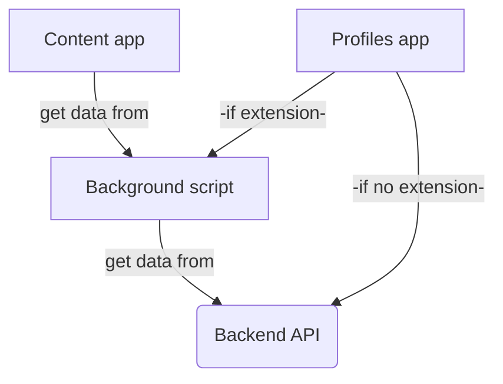

# Testing

## Test the Firefox Addon in Staging and Proding

When you merge a commit with the main branch, it is automatically pushed to Firefox Staging and Proding. Here's how to test how your feature or bug fix is doing in those environments.

1. [Download](https://github.com/dis-moi/extension/releases) the source code archive version of the version you want to test (Staging or Proding).
2. Open Firefox and make sure there's no other active DisMoi addon installed in your browser.
3. Drag the file (in .xpi format) into your Firefox window. Wait for it to load, then accept the terms and conditions popups that appear. Voila, you're testing the Firefox addon!
4. You may want to access the staging back-office to test interactions between the extension and back-office. Ask a super user for login instructions.

> **What's the difference between Staging and Proding?**
> - Staging shows the staging code and presents data from the staging database.
> - Proding is where the staging code and presents data the production (live) database. Changing data inside Proding will alter real data in the production database.

## Extension architecture
Anyway about the logs, take a pick at this flow diagram illustrating the extension architecture :
> https://demo.hedgedoc.org/eI0CDEirRpWHBKgprLjS9Q

## Logs 
There are 2 important console logs to track down a bug:
- The content script console logs are available as usual from the console of the page you're currently browsing
Accessible from `ctrl+maj+i` on my OS
- The background console logs (see this as a *special page* having its own console)
This one need is a bit hidden:
1. `about:addons`
2. _debug Add-ons__
3. Click inspect

Dunno what's best, sometimes @MaartenLMEM used screenshot or video the console, but we might as well copy and paste the logs in the specific issue and use the `code` *backticks* to format these.

> *This content was originally written in #867*
